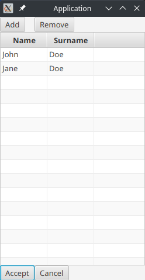

# MvvmFx Table with accept
This simple library adds abstract View and ViewModel with accepting and canceling changes functionality.

### Getting started
To user the library, clone the repo and install it with 
```
mvn install
```
or install jar file manually from the releases page.

### Usage
First, create data class, for example:
```java
public class User {
    private final UUID id;
    private String name;
    private String surname;

    public User() {
        id = UUID.randomUUID();
    }

    public User(UUID id, String name, String username) {
        this.id = id;
        this.name = name;
        this.surname = username;
    }

    public UUID getId() {
        return id;
    }

    public String getName() {
        return name;
    }

    public void setName(String name) {
        this.name = name;
    }

    public String getSurname() {
        return surname;
    }

    public void setSurname(String surname) {
        this.surname = surname;
    }

    @Override
    public String toString() {
        return name + " " + surname;
    }
}
```
Note that it has id. It is only necessary if you use built-in Repository interface and RepositoryTableWithAcceptViewModel

Then you can proceed and create a wrapper for it, it should extend TableItemViewModel class:
```java
public class UserItemViewModel extends TableItemViewModel<User> {
    private final StringProperty name = wrapper.field(User::getName, User::setName);
    private final StringProperty surname = wrapper.field(User::getSurname, User::setSurname);

    public UserItemViewModel(User item) {
        super(item);
    }

    @Override
    protected boolean validate() {
        return !name.get().isEmpty() && !surname.get().isEmpty();
    }

    public StringProperty nameProperty() {
        return name;
    }

    public StringProperty surnameProperty() {
        return surname;
    }
}
```
For more info about ModelWrapper check MvvmFx documentation. All columns of TableView should be described in this file.
`validate()` method checks if name and surname are not empty.

Create ViewModel, which should extend from TableWithAcceptViewModel, or RepositoryTableWithAcceptViewModel:
```java
public class MainViewModel extends RepositoryTableWithAcceptViewModel<User, UserItemViewModel> {
    public MainViewModel() {
        super(User.class, UserItemViewModel.class, new UserRepository());
    }
}
```
If you choose not to use built-in Repository interface, you will have to implement a few methods for getting, adding, removing, updating items.

For this demonstration we will use simple repository based on List:
```java
public class UserRepository implements Repository<User> {
    List<User> users = new ArrayList<>();

    @Override
    public List<User> getAll() {
        return new ArrayList<>(users);
    }

    @Override
    public Optional<User> getById(UUID uuid) {
        return users.stream().filter(user -> user.getId().equals(uuid)).findAny();
    }

    @Override
    public boolean add(User user) {
        return users.add(user);
    }

    @Override
    public boolean remove(User user) {
        return users.remove(user);
    }

    @Override
    public boolean update(User user) {
        Optional<User> oldUser = users.stream().filter(user1 -> user1.getId().equals(user.getId())).findAny();
        boolean updated = oldUser.isPresent();
        oldUser.ifPresent(user1 -> {
            users.remove(user1);
            users.add(user);
        });
        return updated;
    }
}
```

Lastly we will need to create View, which consists of java and fxml files:
```java
public class MainView extends TableWithAcceptView<User, UserItemViewModel, MainViewModel> {
}
```
```xml
<?xml version="1.0" encoding="UTF-8"?>

<?import javafx.scene.control.*?>
<?import javafx.scene.layout.*?>
<?import javafx.scene.control.cell.PropertyValueFactory?>
<?import javafx.scene.control.cell.TextFieldTableCell?>
<GridPane xmlns="http://javafx.com/javafx/18" xmlns:fx="http://javafx.com/fxml/1"
          fx:controller="com.example.libtest.MainView">
    <Button onAction="#add" text="Add"/>
    <Button onAction="#remove" text="Remove" GridPane.columnIndex="1"/>
    <Button onAction="#accept" text="Accept" GridPane.rowIndex="2"/>
    <Button onAction="#cancel" text="Cancel" GridPane.columnIndex="1" GridPane.rowIndex="2"/>
    <TableView fx:id="tableView" GridPane.columnSpan="2" GridPane.hgrow="ALWAYS" GridPane.rowIndex="1"
               GridPane.vgrow="ALWAYS" editable="true">
        <columns>
            <TableColumn text="Name">
                <cellValueFactory>
                    <PropertyValueFactory property="name"/>
                </cellValueFactory>
                <cellFactory>
                    <TextFieldTableCell fx:factory="forTableColumn"/>
                </cellFactory>
            </TableColumn>
            <TableColumn text="Surname">
                <cellValueFactory>
                    <PropertyValueFactory property="surname"/>
                </cellValueFactory>
                <cellFactory>
                    <TextFieldTableCell fx:factory="forTableColumn"/>
                </cellFactory>
            </TableColumn>
        </columns>
    </TableView>
</GridPane>
```
Note that in fxml file TableView has id `tableView`, and that buttons use methods `add()`, `remove()`, `accept()` and `cancel()`.

Final result looks like this:

